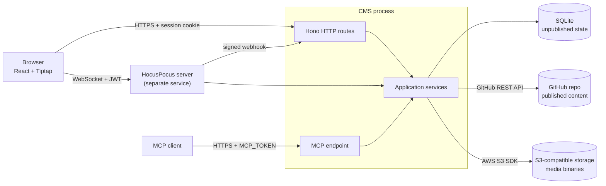

# Architecture

Astro CMS is a small, self-hosted CMS for exactly one Astro project stored in
exactly one GitHub repository. This document describes how the pieces fit
together. The reasons behind each decision live in [`docs/adr/`](adr/README.md).

If a change conflicts with this document, update the document (and add or
supersede an ADR) in the same pull request.

## Goals

- Edit the Markdown/MDX content of one Astro repository through a web UI and MCP.
- Collaborate live on a draft without touching GitHub.
- Publish a draft as a GitHub pull request that a human reviews and merges.
- Stay small enough that a new contributor can read the whole server in an afternoon.

## Non-goals (v1)

- Multiple repositories, teams, organizations, tenants, or billing.
- OAuth or per-user accounts. There is one shared password.
- Editing arbitrary MDX. Unsupported MDX is preserved, not edited.
- A second CMS-specific schema or config system.
- Offline editing, comments, tracked changes, document locking.
- Automatic merging of drafts with changes on `main`.
- A local Git clone.

## System overview



The CMS is one Node.js process ([ADR-0001](adr/0001-single-node-process.md)).
Live editing runs on a separate HocusPocus server
([ADR-0016](adr/0016-collaboration-service.md)); there is still no queue or
cache server.

## Layers

The server has three layers. Dependencies point downward only.

| Layer          | Responsibility                                                                        | Examples                                               |
| -------------- | ------------------------------------------------------------------------------------- | ------------------------------------------------------ |
| **Interfaces** | Translate a transport into service calls. Authenticate the caller. No business rules. | Hono routes, HocusPocus hooks, MCP tools               |
| **Services**   | All business rules. The only code allowed to touch storage.                           | drafts, publishing, media, content discovery, sessions |
| **Adapters**   | Thin wrappers around external systems.                                                | SQLite, GitHub API client, S3 client                   |

The web UI and MCP call **the same services** ([ADR-0011](adr/0011-shared-service-layer.md)).
If an MCP tool needs logic that an HTTP route does not have, that logic belongs
in a service, not in the tool.

## Sources of truth

| Data                         | Source of truth                        | Notes                                            |
| ---------------------------- | -------------------------------------- | ------------------------------------------------ |
| Published Markdown/MDX       | GitHub `main` branch                   | The CMS never writes to `main` directly.         |
| In-progress drafts           | SQLite (Markdown source)               | Drafting never calls GitHub write APIs.          |
| Branch / PR per content item | SQLite, mirrored from GitHub           | One content item has one branch and one PR.      |
| Media binaries               | S3-compatible bucket                   | Only object keys and metadata live in SQLite.    |
| Media references             | SQLite, recomputed                     | Built from drafts, open CMS PRs, and `main`.     |
| Sessions                     | SQLite                                 | Browser sessions only. MCP uses a static token.  |
| Collaborators                | SQLite                                 | Display-name identity, reused across sessions.   |
| Content schema               | `content.config.ts` + existing entries | Raw frontmatter editor when inference is unsafe. |

## Core flows

### Discovery

The server reads the base branch once per commit and caches the result: the
Astro config, the `astro` version from `package.json`, `src/content.config.*`
(the legacy `src/content/config.*` is reported), and the collections that file
declares. The config is parsed, never executed
([ADR-0014](adr/0014-static-content-config-parsing.md)).

### Drafting

1. A user opens a content item (a file path such as `src/content/blog/hello.md`).
2. If no draft exists, the server reads the file and the current base commit
   SHA from the GitHub API and stores the source plus `base_commit_sha` in
   SQLite ([ADR-0013](adr/0013-draft-storage.md)).
3. The editor parses that source into an editor document and saves the
   serialized Markdown back to SQLite as you type
   ([ADR-0015](adr/0015-editor-model-and-serialization.md)). GitHub is not
   contacted. Yjs and HocusPocus replace single-editor saving later.

Collaboration is live editing, presence, and cursors only
([ADR-0010](adr/0010-collaboration-scope.md)).

### Markdown/MDX conversion

- Supported Markdown maps to Tiptap nodes and back.
- Imports, exports, and unsupported JSX/MDX components become **opaque,
  read-only blocks** whose source is preserved byte-for-byte
  ([ADR-0006](adr/0006-mdx-opaque-blocks.md)).
- Frontmatter fields are inferred from `content.config.ts` and existing entries.
  When inference is not safe, the UI falls back to a raw YAML editor
  ([ADR-0007](adr/0007-frontmatter-schema-inference.md)).

### Publishing

1. Compare the draft's `base_commit_sha` with the current `main` SHA.
   If they differ, stop and ask the user to re-sync. There is no automatic
   merge ([ADR-0005](adr/0005-drift-detection.md)).
2. Serialize the Yjs document to Markdown/MDX.
3. Using the GitHub API only ([ADR-0003](adr/0003-github-api-no-clone.md)),
   create or update the item's branch with a commit, and create the PR if it
   does not exist yet ([ADR-0004](adr/0004-one-branch-per-content-item.md)).

### Media

1. Pasting or dropping an image uploads it through the server to the bucket.
2. The editor inserts the returned URL.
3. A sweep, on a timer, recomputes references from drafts, the base branch,
   and every open CMS branch; media with none is stamped unused. Files
   stamped unused past the grace period are deleted, but only if that
   sweep's recompute and rescan both succeeded — one that fails to read
   drafts or the repository deletes nothing at all
   ([ADR-0008](adr/0008-media-storage-and-gc.md),
   [ADR-0021](adr/0021-media-collection.md)).

## GitHub integration

The CMS talks to its one repository through the GitHub REST API only; there is
no local clone ([ADR-0003](adr/0003-github-api-no-clone.md)).

| Piece              | File                                     | Role                                                                                     |
| ------------------ | ---------------------------------------- | ---------------------------------------------------------------------------------------- |
| `GitHubClient`     | `apps/server/src/github/client.ts`       | Small interface: read files, list the tree, branches, commits, pull requests.            |
| HTTP client        | `apps/server/src/github/http-client.ts`  | Implements it with `fetch` against the REST API. The only code that sees `GITHUB_TOKEN`. |
| Fake client        | `apps/server/src/github/fake.ts`         | In-memory repository used by tests.                                                      |
| Repository service | `apps/server/src/services/repository.ts` | CMS rules on top of the client.                                                          |

Rules the repository service enforces:

- At startup it checks the token, push permission, and base branch; the server
  does not start otherwise.
- The base branch is read-only. Writes go only to `cms/…` branches
  ([ADR-0004](adr/0004-one-branch-per-content-item.md)).
- File paths must be repository-relative (no leading `/`, `..`, or `\`).
- Saving to a branch creates it from the base head if missing, adds one commit
  (the Git Data API; the branch moves fast-forward only, which is the "push"),
  and opens a pull request if the branch has none. Later saves add commits to
  the same branch and pull request.
- A `cms/` branch that still exists after its pull request was merged or
  closed is refused, so old history is never reopened.

## Authentication

| Caller     | Credential                                                            | Identity                        |
| ---------- | --------------------------------------------------------------------- | ------------------------------- |
| Browser    | Shared `CMS_PASSWORD` → HTTP-only cookie signed with `SESSION_SECRET` | Collaborator chosen after login |
| HocusPocus | The same session cookie on the WebSocket upgrade                      | Collaborator from session       |
| MCP client | `Authorization: Bearer $MCP_TOKEN`                                    | Fixed label, e.g. `mcp`         |

Login and choosing a display name are separate steps. The display name becomes
a persisted collaborator (`id`, `name`, `created_at`, `last_seen_at`); it is a
label for presence and commit messages, not a security boundary. Anyone with
the password is fully trusted. Every `/api` route requires a session except
health, login, and logout ([ADR-0009](adr/0009-minimal-authentication.md)).

### HTTP API

| Route                                  | Auth       | Purpose                                                                        |
| -------------------------------------- | ---------- | ------------------------------------------------------------------------------ |
| `GET /api/health`                      | public     | `{ "ok": true }` when SQLite answers, else 503.                                |
| `POST /api/session`                    | public     | Log in with `{ "password" }`. Rate-limited.                                    |
| `DELETE /api/session`                  | public     | Log out. Always succeeds.                                                      |
| `GET /api/session`                     | yes        | `{ "collaborator": { id, name } \| null }`.                                    |
| `PUT /api/session/display-name`        | yes        | Choose a display name with `{ "name" }`.                                       |
| `GET /api/repository`                  | yes        | Read-only GitHub checks and repository stats.                                  |
| `GET /api/collections`                 | yes        | Astro project info and its content collections.                                |
| `GET /api/collections/:collection`     | yes        | One collection with its entries.                                               |
| `GET /api/documents`                   | yes        | List or search drafts (`collection`, `status`, `q`).                           |
| `POST /api/documents`                  | yes + name | Open a repository path as a draft.                                             |
| `GET /api/documents/:id`               | yes        | One draft with its source. `?refresh=true` asks GitHub about its pull request. |
| `POST /api/documents/:id/publish`      | yes + name | Commit the draft to its CMS branch and open or update its pull request.        |
| `GET /api/documents/:id/drift`         | yes        | Whether the base branch moved, with its version of the file.                   |
| `POST /api/documents/:id/resync`       | yes + name | Adopt the current base commit as the draft's baseline.                         |
| `GET /api/documents/:id/collaboration` | yes + name | A short-lived room token for HocusPocus.                                       |
| `POST /api/collab/webhook`             | signature  | HocusPocus callbacks: connect, create, change.                                 |
| `POST /api/mcp`                        | MCP token  | The CMS as an MCP server: tools over streamable HTTP.                          |
| `PATCH /api/documents/:id`             | yes + name | Save source, slug, or status.                                                  |
| `DELETE /api/documents/:id`            | yes + name | Delete a draft.                                                                |

Errors always have the shape `{ "error": { "code": "...", "message": "..." } }`.

### Live collaboration

The browser asks the CMS for a room token, then connects to
`HOCUSPOCUS_PUBLIC_URL`; the server and MCP use `HOCUSPOCUS_INTERNAL_URL`.
HocusPocus verifies the JWT, refuses a token whose room is not the document
being opened, and calls back to `POST /api/collab/webhook`, signed with
`HOCUSPOCUS_WEBHOOK_SECRET`:

- `create`: the CMS returns nothing; the first client seeds the room from the
  draft it loaded.
- `change`: debounced, the CMS writes the document back to SQLite as
  Markdown, credited to the collaborator in the connection context.

The `connect` event is not part of the contract: HocusPocus refuses a
connection whose connect webhook fails, which would stop editing during a CMS
restart.

Collaboration is optional. With no `HOCUSPOCUS_*` settings the editor saves
directly over the API instead ([ADR-0016](adr/0016-collaboration-service.md)).

## Persistence

SQLite through `better-sqlite3` with plain SQL and numbered migrations. No ORM
([ADR-0002](adr/0002-sqlite-plain-sql.md)). Tables are added only when the
feature that needs them is built.

## Repository layout

A pnpm workspace ([ADR-0012](adr/0012-pnpm-workspaces-and-tooling.md)):

```
apps/
  server/                 @astro-cms/server: Hono API, runs .ts directly on Node 24
    src/index.ts          process entry: config, database, HTTP server
    src/app.ts            Hono wiring and the public-route allowlist
    src/config.ts         environment validation
    src/astro/            reads content.config.* without executing it
    src/db/               SQLite connection, migrations, document repository
    src/documents/        the draft model
    src/github/           GitHubClient interface, HTTP client, in-memory fake
    src/http/             cookies, authentication middleware, error shape
    src/routes/           Hono route modules (interfaces)
    src/services/         business rules
    src/lib/              small utilities (rate limiter)
    src/test-support/     shared test harness
  web/                    @astro-cms/web: React + Vite frontend
    src/editor/           Tiptap editor, slash menu, autosave
  collab/                 @astro-cms/collab: development HocusPocus server
packages/
  markdown/               @astro-cms/markdown: Markdown/MDX <-> editor document
tooling/
  eslint-config/          @astro-cms/eslint-config: shared lint rules
tsconfig.base.json        compiler options every package extends
docs/
  architecture.md         this file
  adr/                    architecture decision records
```

## Development environment

`compose.yaml` runs two containers from `Dockerfile.dev`: the API with
`node --watch` and the Vite dev server, which proxies `/api` to the API. Source
is bind-mounted from the host; SQLite lives in the `cms-data` volume.
Configuration comes from `.env` (see `.env.example`).

## Deployment

Not built yet. The plan is one production container in which Hono also serves
the built frontend ([ADR-0001](adr/0001-single-node-process.md)).
